Seaborn Tutorial
================

Style management
================

Controlling figure aesthetics
=============================

http://stanford.edu/~mwaskom/software/seaborn/tutorial/aesthetics.html

.. code:: python

    import numpy as np
    import matplotlib as mpl
    import matplotlib.pyplot as plt
    np.random.seed(sum(map(ord, 'aesthetics')))

.. code:: python

    def sinplot(flip=1):
        x = np.linspace(0, 14, 100)
        for i in range(1, 7):
            plt.plot(x, np.sin(x + i * .5) * (7 - i) * flip)

.. code:: python

    sinplot()

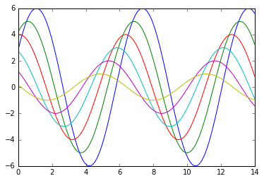

.. code:: python

    import seaborn as sns
    sinplot()

.. parsed-literal::

    /Users/bartev/.virtualenvs/sbrn/lib/python2.7/site-packages/matplotlib/__init__.py:872: UserWarning: axes.color_cycle is deprecated and replaced with axes.prop_cycle; please use the latter.
      warnings.warn(self.msg_depr % (key, alt_key))

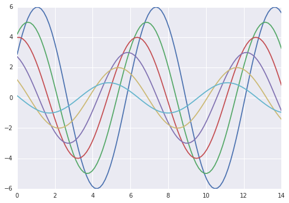

Styling figures with ``axes_style()`` and ``set_style()``
=========================================================

.. code:: python

    sns.plotting_context()

.. parsed-literal::

    {'axes.labelsize': 11.0,
     'axes.titlesize': 12.0,
     'figure.figsize': [8.0, 5.5],
     'grid.linewidth': 1.0,
     'legend.fontsize': 10.0,
     'lines.linewidth': 1.75,
     'lines.markeredgewidth': 0.0,
     'lines.markersize': 7.0,
     'patch.linewidth': 0.3,
     'xtick.labelsize': 10.0,
     'xtick.major.pad': 7.0,
     'xtick.major.width': 1.0,
     'xtick.minor.width': 0.5,
     'ytick.labelsize': 10.0,
     'ytick.major.pad': 7.0,
     'ytick.major.width': 1.0,
     'ytick.minor.width': 0.5}

.. code:: python

    sns.axes_style()

.. parsed-literal::

    {'axes.axisbelow': True,
     'axes.edgecolor': 'white',
     'axes.facecolor': '#EAEAF2',
     'axes.grid': True,
     'axes.labelcolor': '.15',
     'axes.linewidth': 0.0,
     'figure.facecolor': 'white',
     'font.family': [u'sans-serif'],
     'font.sans-serif': [u'Arial',
      u'Liberation Sans',
      u'Bitstream Vera Sans',
      u'sans-serif'],
     'grid.color': 'white',
     'grid.linestyle': u'-',
     'image.cmap': u'Greys',
     'legend.frameon': False,
     'legend.numpoints': 1,
     'legend.scatterpoints': 1,
     'lines.solid_capstyle': u'round',
     'text.color': '.15',
     'xtick.color': '.15',
     'xtick.direction': u'out',
     'xtick.major.size': 0.0,
     'xtick.minor.size': 0.0,
     'ytick.color': '.15',
     'ytick.direction': u'out',
     'ytick.major.size': 0.0,
     'ytick.minor.size': 0.0}

.. code:: python

    sns.set_style('whitegrid')
    data = np.random.normal(size = (20, 6)) + np.arange(6) / 2
    sns.boxplot(data = data)

.. parsed-literal::

    /Users/bartev/.virtualenvs/sbrn/lib/python2.7/site-packages/matplotlib/__init__.py:892: UserWarning: axes.color_cycle is deprecated and replaced with axes.prop_cycle; please use the latter.
      warnings.warn(self.msg_depr % (key, alt_key))

.. parsed-literal::

    <matplotlib.axes._subplots.AxesSubplot at 0x10c33eb50>

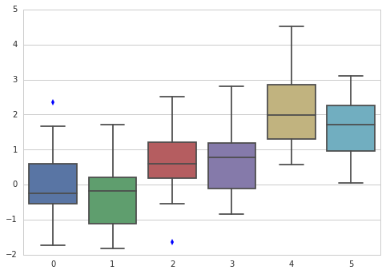

.. code:: python

    sns.set_style('dark')
    sinplot()

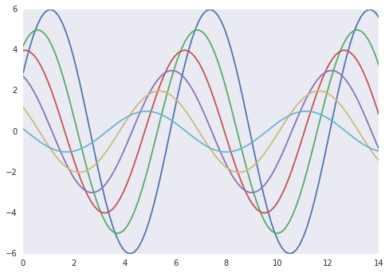

.. code:: python

    sns.set_style('white')
    sinplot()

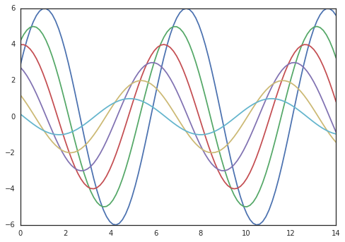

.. code:: python

    sns.set_style('ticks')
    sinplot()

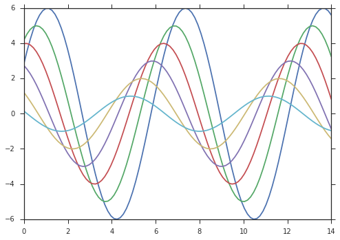

Remove spines with ``despine()``
================================

.. code:: python

    sinplot()
    sns.despine()

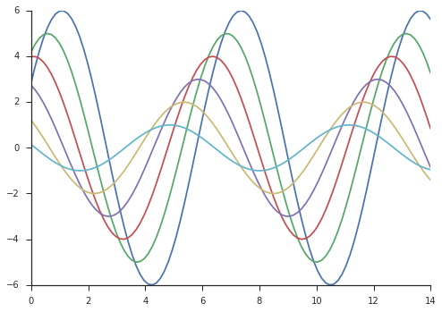

Offset spines away from data
============================

.. code:: python

    f, ax = plt.subplots()

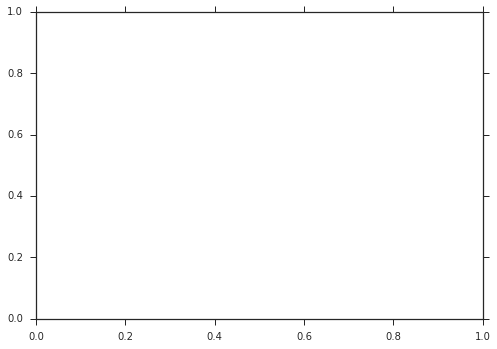

.. code:: python

    type(f)

.. parsed-literal::

    matplotlib.figure.Figure

.. code:: python

    type(ax)

.. parsed-literal::

    matplotlib.axes._subplots.AxesSubplot

.. code:: python

    sns.violinplot(data)
    sns.despine(offset = 10, trim = True)

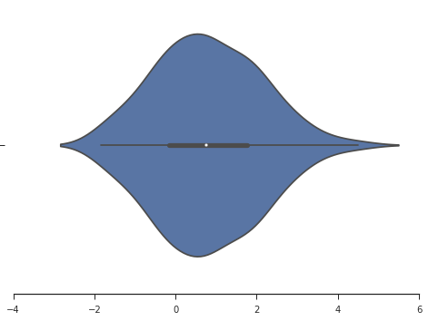

Control which spines are removed
================================

.. code:: python

    sns.set_style('whitegrid')
    sns.boxplot(data = data, palette = 'deep')
    sns.despine(left = True)

.. image:: output_23_0.png

Temporarily set figure style
============================

use ``axes_style() in a``\ with\` statement

.. code:: python

    with sns.axes_style('darkgrid'):
        plt.subplot(211)
        sinplot()
    plt.subplot(212)
    sinplot(-1)

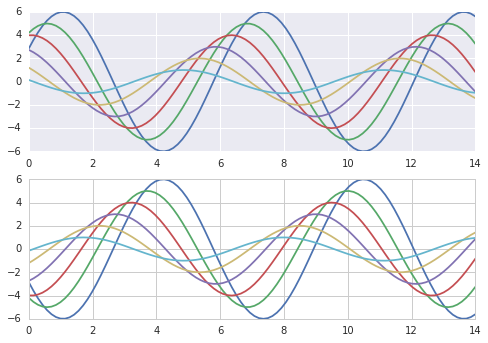

Override elements of seaborn styles
===================================

Pass a dict of params ot the ``rc`` argument of ``axes_style()`` and
``set_style()``

.. code:: python

    sns.axes_style()

.. parsed-literal::

    {'axes.axisbelow': True,
     'axes.edgecolor': '.8',
     'axes.facecolor': 'white',
     'axes.grid': True,
     'axes.labelcolor': '.15',
     'axes.linewidth': 1.0,
     'figure.facecolor': 'white',
     'font.family': [u'sans-serif'],
     'font.sans-serif': [u'Arial',
      u'Liberation Sans',
      u'Bitstream Vera Sans',
      u'sans-serif'],
     'grid.color': '.8',
     'grid.linestyle': u'-',
     'image.cmap': u'Greys',
     'legend.frameon': False,
     'legend.numpoints': 1,
     'legend.scatterpoints': 1,
     'lines.solid_capstyle': u'round',
     'text.color': '.15',
     'xtick.color': '.15',
     'xtick.direction': u'out',
     'xtick.major.size': 0.0,
     'xtick.minor.size': 0.0,
     'ytick.color': '.15',
     'ytick.direction': u'out',
     'ytick.major.size': 0.0,
     'ytick.minor.size': 0.0}

.. code:: python

    sns.set_style(
        'darkgrid',
        {'axes.facecolor' : '0.9'})
    sinplot()

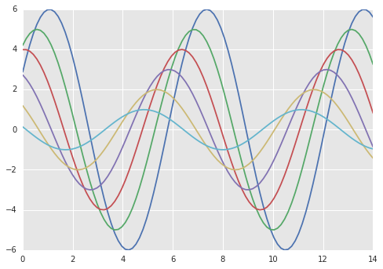

Scale plot elements with ``plotting_context()`` and ``set_context()``
=====================================================================

Reset the default parameters

.. code:: python

    sns.set()

4 preset contexts: \* ``paper`` \* ``notebook`` \* ``talk`` \*
``poster``

.. code:: python

    sns.set_context('paper')
    plt.figure(figsize = (8, 6))
    sinplot()

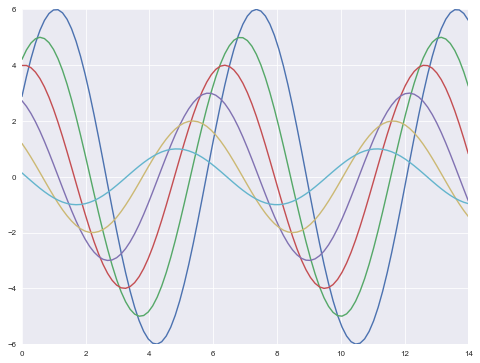

.. code:: python

    sns.set_context('talk')
    plt.figure(figsize = (8, 6))
    sinplot()

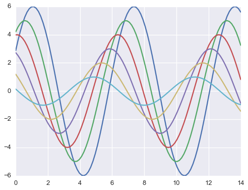

.. code:: python

    sns.set_context('poster')
    plt.figure(figsize = (8, 6))
    sinplot()

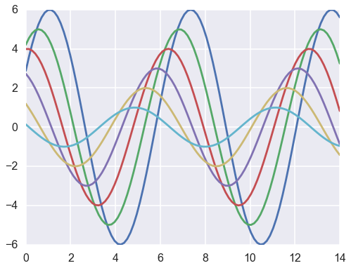

.. code:: python

    sns.set_context(
        'notebook',
        font_scale = 1.5,
        rc = {'lines.linewidth' : 2.5})
    sinplot()

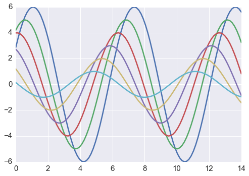

